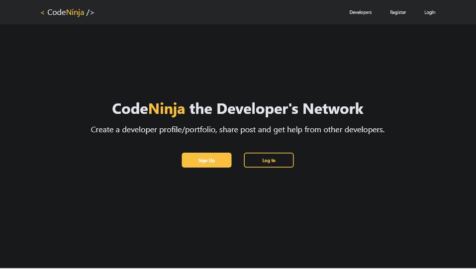
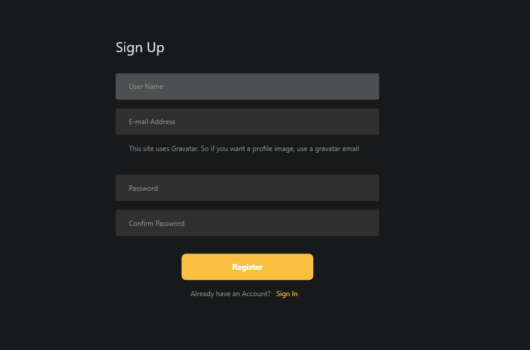
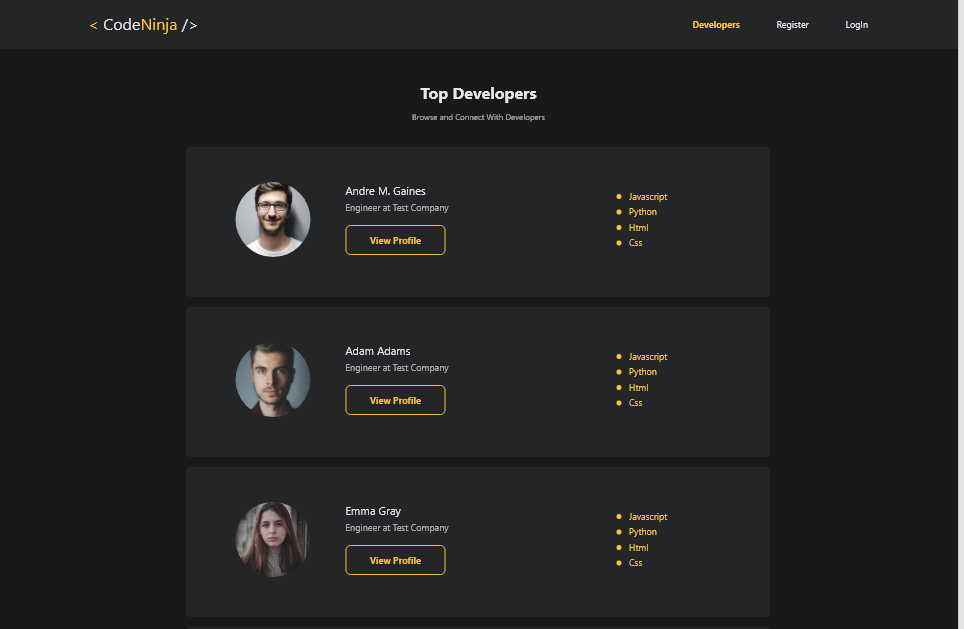
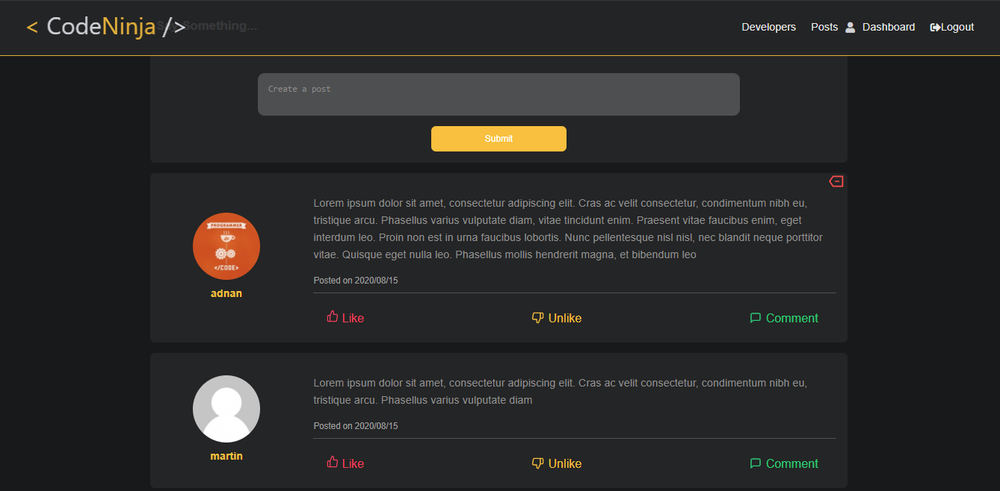

## What I have used?
- React.js 
- Node.js
- Express
- MongoDB Atlas

## Getting Started

## Quick Start 🚀 🚀 🚀

```
# change default.json file in config folder

# this file is located in config/default.json

# add uri of your mongodb connection for example

 "mongoURI": "mongodb://localhost/dev-social",
 
```

```bash
# Install server dependencies
npm install

# Install client dependencies
cd client
npm install

# Run both Express & React from root
npm run dev

# Build for production
cd client
npm run build
```

Open [http://localhost:3000](http://localhost:3000) with your browser to see the result.